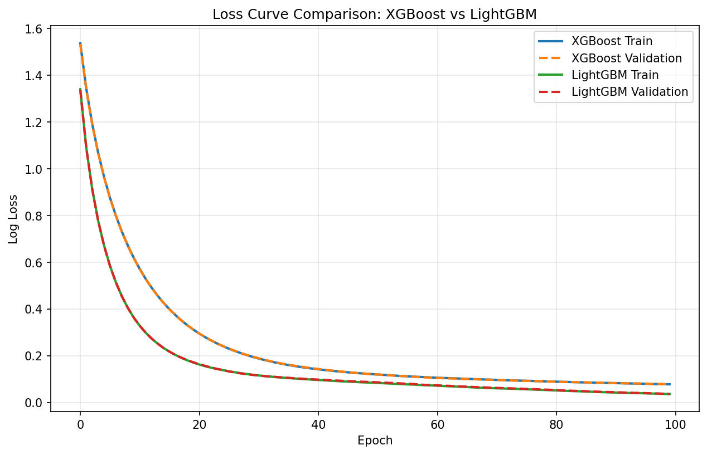

# 🌱 DryBean_ML_Project

> 基于 Dry Bean Dataset 的完整机器学习分类项目 | 5 种算法 · 9 个对比维度 · 93.03% 测试精度


## 📋 目录

- [项目简介](#intro)
- [项目特色](#features)
- [数据描述](#data)
- [数据预处理流程图](#flowchart)
- [数据处理](#clean)
- [算法实现](#algo)
- [实验结果](#results)
- [运行方式](#usage)


<a id="intro"></a>
## 📖 项目简介

本项目基于 Dry Bean Dataset，对 7 类干豆的 16 种形态学特征进行分类预测。工作涵盖完整的数据分析、数据清洗、特征工程、5 种多分类算法对比实验和系统集成。

**核心成果一览**：

| 指标 | 结果 |
|------|------|
| 算法数量 | **5 种**（RF、SVM、XGBoost、LightGBM、MLP） |
| 对比维度 | **9 个**（精度、Loss、速度、鲁棒性、过拟合、混淆矩阵、特征重要性、效率、F1-Score） |
| 最高测试精度 | **93.03%**（XGBoost） |
| 最快推理速度 | **2 ms / 1000 条**（XGBoost） |
| 最强泛化能力 | **过拟合差距仅 0.17%**（SVM） |
| 总样本数 | 13556 条（清洗后） |
| 生成图表 | 17 张 |


<a id="features"></a>
## ✨ 项目特色

- ✅ **完整的工程化结构**：代码按模块组织（数据加载、特征工程、训练、评估），符合企业级项目规范
- ✅ **5 种算法系统对比**：覆盖集成学习、传统机器学习、梯度提升、神经网络四大范式
- ✅ **9 个维度全面评估**：不仅关注精度，还深入分析速度、鲁棒性、过拟合、可解释性等
- ✅ **2 种自主实现算法**：XGBoost 和 LightGBM 均为自行查阅资料实现
- ✅ **17 张高质量图表**：每张图均有详细文字分析，图表配合文字解释
- ✅ **一键运行**：统一命令行入口，无需 GUI，适合自动化部署


<a id="data"></a>
## 📊 数据描述

本实验使用 **Dry Bean Dataset**，包含 **7 种干豆类别**：

| 类别 | 描述 |
|------|------|
| BARBUNYA | 小粒白芸豆 |
| BOMBAY | 孟买豆 |
| CALI | 加利豆 |
| DERMASON | 德马森豆 |
| HOROZ | 公鸡豆 |
| SEKER | 糖豆 |
| SIRA | 西拉豆 |

每个样本由 **16 个形态学特征**描述：

| 特征类型 | 特征名称 | 说明 |
|---------|---------|------|
| 尺寸特征 | Area | 面积（像素单位） |
| 尺寸特征 | Perimeter | 周长 |
| 尺寸特征 | MajorAxisLength | 长轴长度 |
| 尺寸特征 | MinorAxisLength | 短轴长度 |
| 形状特征 | AspectRation | 长宽比 |
| 形状特征 | Eccentricity | 偏心率 |
| 形状特征 | roundness | 圆度 |
| 形状特征 | Compactness | 紧凑度 |
| 衍生特征 | ShapeFactor1 | 复合形状描述子1 |
| 衍生特征 | ShapeFactor2 | 复合形状描述子2 |
| 衍生特征 | ShapeFactor3 | 复合形状描述子3 |
| 衍生特征 | ShapeFactor4 | 复合形状描述子4 |
| 其他几何特征 | ConvexArea | 凸包面积 |
| 其他几何特征 | EquivDiameter | 等效直径 |
| 其他几何特征 | Extent | 延伸率 |
| 其他几何特征 | Solidity | 实度 |

> 教师已预先将数据划分为训练集（9527 条）、验证集（1347 条）和测试集（2737 条）。经清洗后，训练集 9508 条、验证集 1336 条、测试集 2712 条，总计 13556 条有效样本。


<a id="flowchart"></a>
## 📊 数据预处理流程图

## 📊 数据预处理流程图

原始数据（3个Excel文件） → 类名标准化（统一7个标准类别，纠正20+种变体） → 强制数值转换（处理"cm"后缀等非数值内容） → 异常值剔除（Area > 0，MajorAxisLength < 1000） → 缺失值填充（Perimeter和Solidity用中位数填充） → 清洗后数据（无缺失值、无异常值、7个标准类别）

<a id="clean"></a>
## 🧹 数据处理

### 数据清洗策略

| 处理步骤 | 方法 | 说明 |
|---------|------|------|
| **类名标准化** | 建立映射字典统一类别名称 | 纠正大小写、拼写错误、数字替字母等 20+ 种变体 |
| **缺失值填充** | 中位数填充 | Perimeter 和 Solidity 列存在缺失，选择中位数对离群值更稳健 |
| **异常值剔除** | 物理阈值过滤 | Area > 0，MajorAxisLength < 1000 |
| **强制数值转换** | pd.to_numeric | 处理 "cm" 后缀等非数值内容 |
| **特征标准化** | StandardScaler | 均值 0，方差 1 |

### 清洗效果

| 数据集 | 原始行数 | 清洗后行数 | 删除行数 | 唯一类别数 |
|--------|---------|-----------|---------|-----------|
| 训练集 | 9527 | 9508 | 19 | 7 |
| 验证集 | 1347 | 1336 | 11 | 7 |
| 测试集 | 2737 | 2712 | 25 | 7 |

全部清洗后，三类数据的 Class 列均只包含 7 个标准类别，无缺失值，无异常值。


<a id="algo"></a>
## 🤖 算法实现

本实验实现 **5 种多分类算法**：

| 算法 | 类型 | 核心特点 |
|------|------|---------|
| Random Forest | 集成学习（Bagging） | 多棵决策树投票，抗过拟合能力强 |
| SVM | 传统机器学习 | RBF 核函数，最大化类别间隔 |
| XGBoost | 梯度提升（Boosting） | 二阶泰勒展开，正则化控制，缺失值自动处理 |
| LightGBM | 梯度提升（Boosting） | 直方图训练，Leaf-wise 生长，训练速度快 |
| MLP | 神经网络 | 双隐藏层（128+64），ReLU + Adam |


<a id="results"></a>
## 📈 实验结果

### 精度对比表

| 模型 | 训练集精度 | 测试集精度 | 过拟合差距 | 训练耗时(s) | 推理速度(ms/1000条) |
|------|-----------|-----------|-----------|------------|-------------------|
| **XGBoost** | 97.42% | **93.03%** | 4.39% | 0.61 | **2.00** |
| SVM | 93.13% | 92.96% | **0.17%** | **0.31** | 119.54 |
| LightGBM | 99.38% | 92.70% | 6.69% | 2.15 | 4.80 |
| MLP | 93.13% | 92.59% | 0.54% | 2.56 | 2.99 |
| Random Forest | 100.00% | 92.00% | 8.00% | 0.30 | 26.79 |

### 关键结论

- 🏆 **XGBoost**：测试精度最高（93.03%），推理速度最快（2ms/1000条），综合表现最优
- 🛡️ **SVM**：泛化能力最强（过拟合差距仅 0.17%），鲁棒性最好
- ⚡ **LightGBM**：训练速度快，但过拟合较明显（6.69%）
- 📊 **MLP**：表现稳健（92.59%），过拟合很小（0.54%）
- 🌲 **Random Forest**：训练集 100% 过拟合明显，但测试精度仍达 92%

### 特征重要性（XGBoost）


**ShapeFactor3**（31.68%）和 **ConvexArea**（21.71%）是最关键的两个特征，合计贡献超过 50% 的分类信息。Eccentricity 和 EquivDiameter 的重要性均为 0，表明这两个特征在分类过程中未提供有效信息，后续可考虑剔除。

### 鲁棒性对比


SVM 在所有噪声强度下均表现最稳健，20% 噪声下仍保持 **91.96%** 精度。树模型在 20% 噪声下均出现约 3-4% 的精度下降。

### Loss 曲线对比



XGBoost 和 LightGBM 同为梯度提升树模型，迭代单位一致（均为单轮新增一棵决策树）。LightGBM 在训练初期损失下降更快，收敛速度优于 XGBoost；从最终损失值来看，LightGBM 的训练与验证损失均低于 XGBoost。验证集上的损失优劣趋势与测试集精度结果存在小幅差异：验证集上 LightGBM 损失更优，而测试集上 XGBoost 分类准确率（93.03%）略高于 LightGBM（92.70%）。

### 实验图表清单

| 图表名称 | 用途 | 对应章节 |
|---------|------|---------|
| class_distribution.png | 类别分布 | 数据分析 |
| feature_correlation.png | 特征相关性热图 | 数据分析 |
| xgb_loss_curve.png | XGBoost 训练曲线 | Loss 分析 |
| lgb_loss_curve.png | LightGBM 训练曲线 | Loss 分析 |
| mlp_loss_curve.png | MLP 训练曲线 | Loss 分析 |
| loss_curve_comparison.png | XGB vs LGB 对比 | Loss 分析 |
| robustness_comparison.png | 鲁棒性对比 | 鲁棒性分析 |
| feature_importance.png | 特征重要性 | 可解释性分析 |
| efficiency_comparison.png | 训练效率对比 | 效率分析 |
| f1_score_heatmap.png | F1-Score 热图 | 细粒度评估 |
| cm_*.png（5张） | 混淆矩阵 | 错误模式分析 |


<a id="usage"></a>
## 🛠️ 运行方式

```bash
# 1. 安装依赖
pip install -r requirements.txt

# 2. 运行完整实验（5种算法 + 所有对比分析）
python run_experiments.py

# 3. 只做数据清洗
python main.py --mode data

# 4. 预测新数据
python main.py --mode predict --input <文件路径> --output <输出文件>

##预期输出

运行 python run_experiments.py 后，终端将依次输出：

1.5 种算法的训练集精度、测试集精度、过拟合差距、训练耗时、推理耗时

2.鲁棒性测试结果（4 种噪声强度）

3.特征重要性分析

4.所有图表自动保存至 results/figures/ 目录

📁 项目结构

DryBean_ML_Project/
├── data/                     # 原始数据（三个 Excel 文件）
├── src/
│   ├── __init__.py
│   ├── data_loader.py        # 数据加载与清洗
│   └── feature_engineering.py # 特征工程（标准化）
├── models/                   # 5 个已训练模型 + scaler.pkl
├── results/
│   ├── metrics.csv           # 精度对比表
│   └── figures/              # 17 张实验图表
├── run_experiments.py        # 完整实验脚本
├── main.py                   # 统一命令行入口
├── requirements.txt
├── .gitignore
├── LICENSE
└── README.md