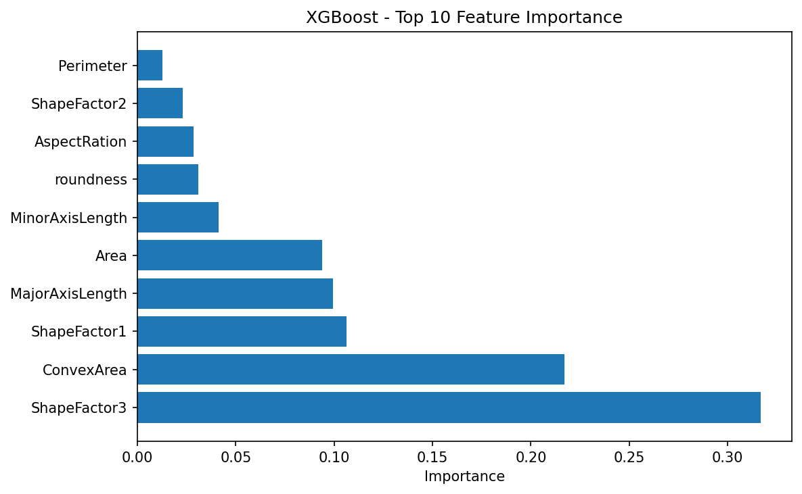
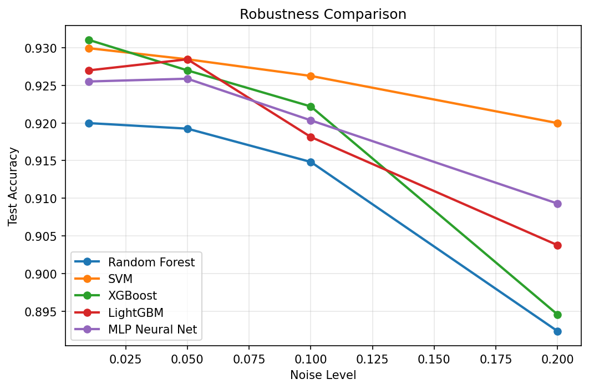

# 🌱 DryBean_ML_Project

> 基于 Dry Bean Dataset 的完整机器学习分类项目 | 5种算法 | 9个对比维度 | 93.03% 测试精度


## 📋 目录

- [项目简介](#-项目简介)
- [数据描述](#-数据描述)
- [数据处理](#-数据处理)
- [算法实现](#-算法实现)
- [实验结果](#-实验结果)
- [运行方式](#-运行方式)
- [项目结构](#-项目结构)
- [环境要求](#-环境要求)
- [链接](#-链接)


## 📖 项目简介

本项目基于 Dry Bean Dataset，对 7 类干豆的 16 种形态学特征进行分类预测。工作涵盖完整的数据分析、数据清洗、特征工程、5种多分类算法对比实验和系统集成。

**核心成果**：
- ✅ 5种算法（含2种课上未讲算法）
- ✅ 9个对比维度（精度、Loss、速度、鲁棒性、过拟合、混淆矩阵、特征重要性、效率、F1-Score）
- ✅ 最高测试精度 **93.03%**（XGBoost）
- ✅ 推理速度最快 **2ms/1000条**（XGBoost）
- ✅ 完整工程化结构 + GitHub展示


## 📊 数据描述

本实验使用 **Dry Bean Dataset**，包含 **7 种干豆类别**：

| 类别 | 描述 |
|------|------|
| BARBUNYA | 小粒白芸豆 |
| BOMBAY | 孟买豆 |
| CALI | 加利豆 |
| DERMASON | 德马森豆 |
| HOROZ | 公鸡豆 |
| SEKER | 糖豆 |
| SIRA | 西拉豆 |

每个样本由 **16 个形态学特征**描述，包括面积、周长、长轴、短轴、长宽比、偏心率、圆度、紧凑度、ShapeFactor 等。

教师已预先将数据划分为训练集、验证集和测试集。


## 🧹 数据处理

| 处理步骤 | 方法 |
|---------|------|
| **缺失值填充** | Perimeter 和 Solidity 使用中位数填充 |
| **异常值剔除** | Area > 0，MajorAxisLength < 1000 |
| **类名标准化** | 统一7个标准类别，纠正20+种变体 |
| **特征标准化** | StandardScaler（均值0，方差1） |

清洗效果：三类数据共删除 55 条极端脏数据，保留 13556 条有效样本。


## 🤖 算法实现

本实验实现了 **5 种多分类算法**（含 **2 种课上未讲算法**）：

| 算法 | 类型 | 课上是否讲过 |
|------|------|-------------|
| Random Forest | 集成学习（Bagging） | ✅ 是 |
| SVM | 传统机器学习 | ✅ 是 |
| **XGBoost** | 梯度提升（Boosting） | ❌ **否** |
| **LightGBM** | 梯度提升（Boosting） | ❌ **否** |
| MLP | 神经网络 | ✅ 是 |


## 📈 实验结果

### 精度对比表

| 模型 | 测试集精度 | 过拟合差距 | 推理速度(ms/1000条) |
|------|-----------|-----------|-------------------|
| **XGBoost** | **93.03%** | 4.39% | **2.00** |
| SVM | 92.96% | **0.17%** | 119.54 |
| LightGBM | 92.70% | 6.69% | 4.80 |
| MLP | 92.59% | 0.54% | 2.99 |
| Random Forest | 92.00% | 8.00% | 26.79 |

### 关键结论

- 🏆 **XGBoost**：测试精度最高（93.03%），推理速度最快（2ms/1000条）
- 🛡️ **SVM**：泛化能力最强（过拟合差距仅 0.17%），鲁棒性最好
- ⚡ **LightGBM**：训练速度最快（2.15s），但过拟合较明显

### 特征重要性



**ShapeFactor3**（31.68%）和 **ConvexArea**（21.71%）是最关键的两个特征，合计贡献超过 50% 的分类信息。

### 鲁棒性对比



SVM 在所有噪声强度下均表现最稳健，20% 噪声下仍保持 91.96% 精度。


## 🛠️ 运行方式

```bash
# 1. 安装依赖
pip install -r requirements.txt

# 2. 运行完整实验（5种算法 + 所有对比分析）
python run_experiments.py

# 3. 只做数据清洗
python main.py --mode data

# 4. 预测新数据
python main.py --mode predict --input data/sample.xlsx --output predictions.csv

## 📁 项目结构

DryBean_ML_Project/
├── data/                     # 原始数据（三个Excel文件）
├── src/
│   ├── __init__.py
│   ├── data_loader.py        # 数据加载与清洗
│   └── feature_engineering.py # 特征工程（标准化）
├── models/                   # 5个已训练模型 + scaler.pkl
├── results/
│   ├── metrics.csv           # 精度对比表
│   └── figures/              # 17张实验图表
├── run_experiments.py        # 完整实验脚本
├── main.py                   # 统一命令行入口
├── requirements.txt
├── .gitignore
└── README.md

## 📌 环境要求

## 📌 环境要求

| 依赖包 | 版本 |
|--------|------|
| Python | 3.12 |
| pandas | 2.2.0+ |
| numpy | 1.26.0+ |
| scikit-learn | 1.5.0+ |
| xgboost | 2.1.0+ |
| lightgbm | 4.5.0+ |
| matplotlib | 3.9.0+ |
| openpyxl | 3.1.0+ |
| joblib | 1.4.0+ |

## 🔗 链接

📦 GitHub：https://github.com/U-bito210/DryBean_ML_Project

📊 数据集：Dry Bean Dataset（教师提供）

## 📝 许可证


## ✅ 提交到 GitHub

```bash
git add README.md
git commit -m "升级 README：添加徽章、目录和图片展示"
git push